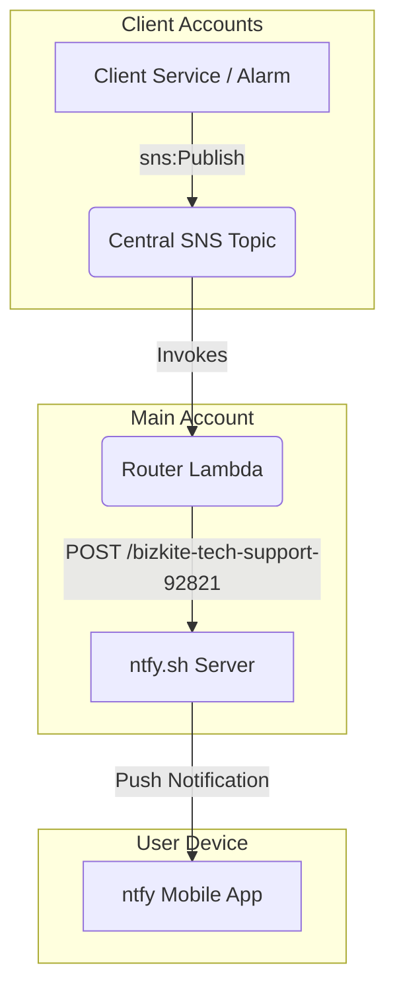

# AWS Cross-Account Notification Hub (ntfy)

This project sets up a centralized, serverless notification hub in your main AWS account. Client AWS accounts (e.g., those you provide tech support to) can publish alerts to a central Amazon SNS topic, which triggers a Lambda function that forwards the notification directly to your phone via **ntfy.sh**.

We use **AWS CDK (TypeScript)** for infrastructure as code.

---

## Architecture Overview



1. **Central SNS Topic (`CentralTechSupportNotifications`)**:
   An SNS topic created in the main account. Its resource policy is configured to allow `sns:Publish` from whitelisted client AWS accounts.
2. **Router Lambda (`TechSupportNotificationRouter`)**:
   A lightweight Node.js Lambda function subscribed to the SNS topic. It extracts message details, evaluates the urgency, adds priority/tags, and forwards it to `https://ntfy.sh/bizkite-tech-support-92821`.

---

## Project Structure

- [config/config.json](file:///home/mstouffer/repos/notification-hub/config/config.json) — Configuration file for whitelisting AWS accounts and specifying the ntfy topic.
- [lambda/index.js](file:///home/mstouffer/repos/notification-hub/lambda/index.js) — The router Lambda function that forwards messages to ntfy.sh.
- [lib/notification-hub-stack.ts](file:///home/mstouffer/repos/notification-hub/lib/notification-hub-stack.ts) — The AWS CDK stack defining the resources.
- [bin/notification-hub.ts](file:///home/mstouffer/repos/notification-hub/bin/notification-hub.ts) — Main CDK application entrypoint.

---

## Setup & Deployment Guide

### 1. Whitelist Client Accounts

Open the [config/config.json](file:///home/mstouffer/repos/notification-hub/config/config.json) file and update it with the client AWS accounts you want to accept notifications from:

```json
{
  "ntfyTopic": "bizkite-tech-support-92821",
  "clientAccountIds": [
    "111122223333",
    "444455556666"
  ]
}
```

### 2. Deploy the Stack to Your Main Account

Ensure your terminal is authenticated with your **main AWS account credentials**, then run:

```bash
# Install dependencies
npm install

# Bootstrap CDK (only required once per account/region)
npx cdk bootstrap

# Review resource diff
npx cdk diff

# Deploy the stack
npx cdk deploy
```

Upon successful deployment, the console will output the ARN of the SNS Topic:
`NotificationHubStack.CentralSNSTopicArn = arn:aws:sns:us-east-1:MAIN_ACCOUNT_ID:CentralTechSupportNotifications`

Save this ARN, as you will need to provide it to the client accounts.

---

## Client Account Configuration

In each client's AWS account, perform the following steps to allow services or users to publish alerts to your central topic:

### 1. Attach IAM Policy to Client Services
Attach the following policy to the IAM Role or User in the client account that needs to send alerts (e.g., Lambda functions, EC2 instances, CloudWatch Alarms):

```json
{
  "Version": "2012-10-17",
  "Statement": [
    {
      "Sid": "AllowPublishToCentralNotificationHub",
      "Effect": "Allow",
      "Action": "sns:Publish",
      "Resource": "arn:aws:sns:us-east-1:MAIN_ACCOUNT_ID:CentralTechSupportNotifications"
    }
  ]
}
```
*(Replace `MAIN_ACCOUNT_ID` with your actual main AWS account ID).*

### 2. Send a Test Message
From the client account, you can publish a test message using the AWS CLI:

```bash
aws sns publish \
  --topic-arn "arn:aws:sns:us-east-1:MAIN_ACCOUNT_ID:CentralTechSupportNotifications" \
  --subject "CRITICAL: Database Disk Space Low" \
  --message "Instance db-prod-01 has reached 92% disk usage. Please inspect immediately."
```

---

## Context-Aware Priorities & Tags

The Router Lambda ([lambda/index.js](file:///home/mstouffer/repos/notification-hub/lambda/index.js)) automatically analyzes the SNS subject and message body to format notifications with relevant tags and priorities on your phone:

| Condition | Priority | Tags (Emojis) |
| :--- | :--- | :--- |
| Contains `critical`, `error`, or `alarm` | **High** (`high`) | `aws,sns,warning,skull` ⚠️💀 |
| Contains `resolved` or `ok` | **Low** (`low`) | `aws,sns,white_check_mark` ✅ |
| Standard / Default | **Normal** (`default`) | `aws,sns` ☁️ |
